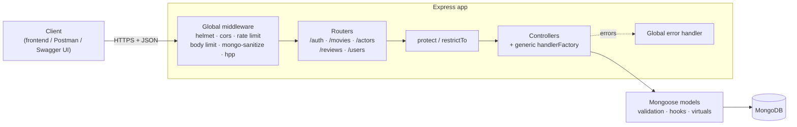
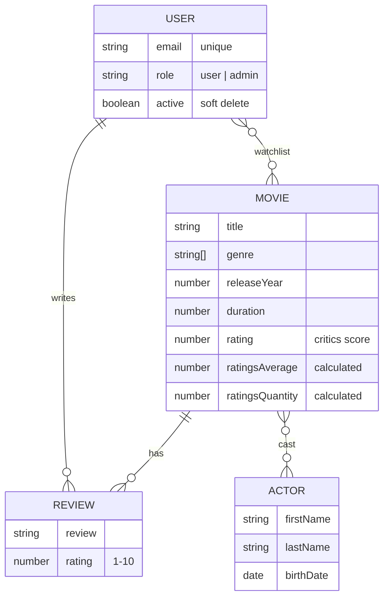

# 🎬 Movie API

[](https://github.com/sebi-development/movie-api/actions/workflows/ci.yml)


A production-ready REST API for a movie database: movies, actors, user reviews with live rating aggregation, and personal watchlists. It has JWT authentication with role-based access control, interactive OpenAPI docs and a 100-test integration suite that runs against a real (in-memory) MongoDB.

> **Interactive docs:** start the server and open **http://localhost:3000/api-docs**

---

## Table of Contents

- [Features](#-features)
- [Tech Stack](#-tech-stack)
- [Architecture](#-architecture)
- [Getting Started](#-getting-started)
- [Environment Variables](#-environment-variables)
- [API Reference](#-api-reference)
- [Querying Collections](#-querying-collections)
- [Response Format](#-response-format)
- [Testing](#-testing)
- [Security](#-security)
- [Project Structure](#-project-structure)
- [Design Decisions](#-design-decisions)
- [Roadmap](#-roadmap)

---

## ✨ Features

| Area | What it does |
| --- | --- |
| **Authentication** | Signup / login with JWT, bcrypt-hashed passwords, password change that invalidates older tokens |
| **Authorization** | `user` and `admin` roles; review ownership checks (authors edit their own, admins moderate all) |
| **Movies** | Full CRUD, full-text search, filtering, sorting, field limiting, pagination with metadata |
| **Actors** | Full CRUD with filmography (virtual populate) and computed `fullName` / `age` |
| **Reviews** | One review per user per movie; the movie's `ratingsAverage` / `ratingsQuantity` are recalculated on every create, update and delete |
| **Watchlist** | Add, remove and clear using atomic MongoDB operators (`$addToSet`, `$pull`), safe under concurrent requests |
| **Aggregations** | `/movies/top-5-movies` alias and `/movies/movie-stats` per-genre pipeline |
| **User management** | Profile updates, soft-delete (`deleteMe`) and admin CRUD with cascading clean-up |
| **Data integrity** | Deleting a movie removes its reviews and watchlist entries; deleting an actor removes them from casts; deleting a user removes their reviews and fixes affected ratings |
| **Docs** | OpenAPI 3.0 spec with Swagger UI; importable into Postman or Insomnia |
| **Ops** | Health check endpoint, graceful shutdown, env validation, GitHub Actions CI on Node 20/22/24 |

## 🛠 Tech Stack

- **Runtime:** Node.js ≥ 20.19
- **Framework:** Express 4
- **Database:** MongoDB with Mongoose 9
- **Auth:** JSON Web Tokens (`jsonwebtoken`), `bcryptjs`
- **Security:** `helmet`, `express-rate-limit`, `express-mongo-sanitize`, `hpp`, `cors`
- **Docs:** OpenAPI 3.0 + `swagger-ui-express`
- **Testing:** Jest, Supertest, `mongodb-memory-server` (no Docker or local MongoDB required)
- **Quality:** ESLint ([neostandard](https://github.com/neostandard/neostandard)), GitHub Actions

## 🏗 Architecture



**Data model**



## 🚀 Getting Started

### Prerequisites

- Node.js **20.19+** and npm
- A MongoDB database: a free [MongoDB Atlas](https://www.mongodb.com/atlas) cluster or a local `mongod`

> The **test suite needs neither**. It starts its own in-memory MongoDB automatically.

### Installation

```bash
git clone https://github.com/sebi-development/movie-api.git
cd movie-api
npm install
cp .env.example .env        # then set DATABASE_URI and JWT_SECRET
```

### Seed sample data (optional)

Loads 15 movies, 8 actors, 4 users and 22 reviews:

```bash
npm run data:import   # insert sample data
npm run data:reset    # wipe and re-import
npm run data:delete   # remove everything
```

Demo accounts (password: `password123`):

| Email | Role |
| --- | --- |
| `admin@movieapi.dev` | admin |
| `jane@example.com` | user |
| `mark@example.com` | user |
| `lena@example.com` | user |

### Run

```bash
npm run dev     # development with auto-reload (nodemon)
npm start       # production
```

The API runs on `http://localhost:3000`. Docs are at `/api-docs` and the health check is at `/api/v1/health`.

### Quick try

```bash
# Log in and store the token
TOKEN=$(curl -s -X POST http://localhost:3000/api/v1/auth/login \
  -H "Content-Type: application/json" \
  -d '{"email":"jane@example.com","password":"password123"}' | node -pe "JSON.parse(require('fs').readFileSync(0)).token")

# Top rated movies (public)
curl "http://localhost:3000/api/v1/movies/top-5-movies"

# Add Inception to your watchlist
curl -X POST -H "Authorization: Bearer $TOKEN" \
  http://localhost:3000/api/v1/users/me/watchlist/64b000000000000000000b03
```

### Available scripts

| Script | Description |
| --- | --- |
| `npm run dev` | Start with nodemon |
| `npm start` | Start in production mode |
| `npm test` | Run the integration test suite |
| `npm run test:coverage` | Run tests with a coverage report |
| `npm run lint` / `lint:fix` | Lint (and auto-fix) the codebase |
| `npm run data:import` / `data:delete` / `data:reset` | Manage seed data |

## 🔐 Environment Variables

| Variable | Required | Default | Description |
| --- | :---: | --- | --- |
| `DATABASE_URI` | ✅ | — | MongoDB connection string |
| `JWT_SECRET` | ✅ | — | Secret used to sign tokens (use 32+ random characters) |
| `JWT_EXPIRES_IN` | | `7d` | Token lifetime (`90m`, `12h`, `7d`, …) |
| `NODE_ENV` | | `development` | `development` shows stack traces; `production` hides them and trusts the first proxy |
| `PORT` | | `3000` | HTTP port |
| `CORS_ORIGIN` | | `*` | Comma-separated list of allowed origins |
| `RATE_LIMIT_MAX` | | `300` | Requests per IP per hour on `/api` |

The server refuses to start if a required variable is missing.

## 📖 API Reference

Base URL: `/api/v1`. 🔓 = public · 🔑 = logged in · 👑 = admin only

### Auth

| Method | Endpoint | Access | Description |
| --- | --- | :---: | --- |
| `POST` | `/auth/signup` | 🔓 | Create an account (always role `user`) |
| `POST` | `/auth/login` | 🔓 | Log in, returns a JWT |
| `PATCH` | `/auth/updateMyPassword` | 🔑 | Change password (requires current password), returns a new JWT |

### Movies

| Method | Endpoint | Access | Description |
| --- | --- | :---: | --- |
| `GET` | `/movies` | 🔓 | List movies: search, filter, sort, paginate |
| `GET` | `/movies/top-5-movies` | 🔓 | Five best rated movies |
| `GET` | `/movies/movie-stats` | 🔓 | Aggregated statistics per genre |
| `GET` | `/movies/:id` | 🔓 | Movie with cast and reviews |
| `POST` | `/movies` | 👑 | Create a movie |
| `PATCH` | `/movies/:id` | 👑 | Update a movie |
| `DELETE` | `/movies/:id` | 👑 | Delete a movie, its reviews and watchlist entries |

### Reviews

| Method | Endpoint | Access | Description |
| --- | --- | :---: | --- |
| `GET` | `/reviews` | 🔓 | List all reviews |
| `GET` | `/movies/:movieId/reviews` | 🔓 | List reviews of a movie |
| `GET` | `/reviews/:id` | 🔓 | Get a review |
| `POST` | `/movies/:movieId/reviews` | 🔑 user | Review a movie (one per user per movie) |
| `POST` | `/reviews` | 🔑 user | Same, with `movie` in the body |
| `PATCH` | `/reviews/:id` | 🔑 author / 👑 | Edit `review` / `rating` |
| `DELETE` | `/reviews/:id` | 🔑 author / 👑 | Delete a review |

### Actors

| Method | Endpoint | Access | Description |
| --- | --- | :---: | --- |
| `GET` | `/actors` | 🔓 | List actors |
| `GET` | `/actors/:id` | 🔓 | Actor with filmography |
| `POST` | `/actors` | 👑 | Create an actor |
| `PATCH` | `/actors/:id` | 👑 | Update an actor |
| `DELETE` | `/actors/:id` | 👑 | Delete an actor and remove them from all casts |

### Current user & watchlist

| Method | Endpoint | Access | Description |
| --- | --- | :---: | --- |
| `GET` | `/users/me` | 🔑 | Your profile |
| `PATCH` | `/users/updateMe` | 🔑 | Update `name` / `email` |
| `DELETE` | `/users/deleteMe` | 🔑 | Deactivate your account (soft delete) |
| `GET` | `/users/me/watchlist` | 🔑 | Your watchlist (populated) |
| `POST` | `/users/me/watchlist/:movieId` | 🔑 | Add a movie (`409` if already added) |
| `DELETE` | `/users/me/watchlist/:movieId` | 🔑 | Remove a movie |
| `DELETE` | `/users/me/watchlist` | 🔑 | Clear the watchlist |

### Users (admin)

| Method | Endpoint | Access | Description |
| --- | --- | :---: | --- |
| `GET` | `/users` | 👑 | List users |
| `GET` | `/users/:id` | 👑 | Get a user |
| `PATCH` | `/users/:id` | 👑 | Update `name`, `email`, `role`, `photo` |
| `DELETE` | `/users/:id` | 👑 | Delete a user and their reviews |

### System

| Method | Endpoint | Description |
| --- | --- | --- |
| `GET` | `/api/v1/health` | Liveness + database status (`503` when the DB is down) |
| `GET` | `/api-docs` | Swagger UI |

Full request and response schemas are in [`docs/swagger.yaml`](docs/swagger.yaml). You can import that file directly into Postman (*Import → File*) to get a ready-made collection.

## 🔎 Querying Collections

Every list endpoint (`/movies`, `/actors`, `/reviews`, `/users`) supports the same query language:

| Feature | Example |
| --- | --- |
| Exact match | `/movies?director=Christopher Nolan` |
| Match any of several values | `/movies?genre=Drama&genre=Crime` |
| Comparison (`gt`, `gte`, `lt`, `lte`, `ne`) | `/movies?duration[gte]=120&releaseYear[lt]=2000` |
| Sort (`-` = descending) | `/movies?sort=-ratingsAverage,releaseYear` |
| Select fields | `/movies?fields=title,releaseYear,ratingsAverage` |
| Paginate (max 100 per page) | `/movies?page=2&limit=5` |
| Full-text search (movies) | `/movies?search=dream heist` |

## 📦 Response Format

**Collections** include pagination metadata:

```json
{
  "status": "success",
  "results": 2,
  "pagination": { "total": 15, "page": 1, "limit": 2, "pages": 8 },
  "data": { "movies": [ { "title": "Inception", "...": "..." } ] }
}
```

**Errors** use a consistent shape and correct HTTP status codes (`400`, `401`, `403`, `404`, `409`, `413`, `429`, `500`):

```json
{
  "status": "fail",
  "message": "Invalid input data. A movie must have a director",
  "errors": { "director": "A movie must have a director" }
}
```

Unexpected errors return a generic `500` message in production. Stack traces are only included when `NODE_ENV=development`.

## 🧪 Testing

```bash
npm test                 # 100 integration tests
npm run test:coverage    # with coverage report (~98% lines)
```

Tests send real HTTP requests through the full Express stack with **Supertest**. Each test file gets its own throwaway MongoDB from **mongodb-memory-server**, so tests are isolated, need no configuration, and never touch your real database. The first run downloads a MongoDB binary (about 100 MB), which is cached afterwards.

| Suite | Covers |
| --- | --- |
| `auth.test.js` | Signup validation, duplicate emails, login, JWT verification, expired/tampered tokens, password change invalidating old tokens |
| `movies.test.js` | Listing, pagination, filtering, operators, sorting, search, CRUD, admin-only access, cascade delete, aggregation endpoints |
| `reviews.test.js` | Public reads, rating recalculation on create/update/delete, one-review-per-movie, ownership rules, author spoofing prevention |
| `watchlist.test.js` | Add, duplicate prevention, concurrent adds, invalid/unknown ids, remove, clear |
| `users.test.js` | Profile, `updateMe` field whitelisting, soft delete, admin user management |
| `actors.test.js` | CRUD, virtuals, filmography, cast clean-up on delete |
| `app.test.js` | 404 handling, malformed JSON, security headers, NoSQL injection, docs and health endpoints |

CI runs lint and the full suite on Node 20, 22 and 24 for every push and pull request.

## 🛡 Security

- **Passwords** are hashed with bcrypt (cost 12) and never returned. `toJSON` strips sensitive fields even if a query selects them.
- **JWT** tokens are verified on every protected request, including checks that the user still exists, is active, and hasn't changed their password since the token was issued.
- **Mass assignment protection:** every write endpoint whitelists its fields, so clients can't set `role`, `ratingsAverage`, `active`, review authorship and similar fields.
- **NoSQL injection:** `$` operators are stripped from input, and the query builder only maps a small whitelist of comparison operators.
- **Rate limiting:** 300 requests/hour per IP on the API, with a stricter 20 per 15 minutes on login and signup.
- **Hardening:** Helmet security headers, 10 kb body limit, HTTP parameter pollution protection, configurable CORS.
- **No user enumeration:** login returns the same message for an unknown email and a wrong password.

## 📁 Project Structure

```
movie-api/
├── app.js                  # Express app: middleware, routes, error handling
├── server.js               # Entry point: env validation, DB connection, graceful shutdown
├── config/
│   └── env.js              # Loads and validates environment variables
├── controllers/
│   ├── handlerFactory.js   # Generic getAll / getOne / createOne / updateOne / deleteOne
│   ├── authController.js   # signup, login, protect, restrictTo, updateMyPassword
│   ├── movieController.js  # CRUD + top-5 alias + genre stats aggregation
│   ├── actorController.js
│   ├── reviewController.js
│   └── userController.js   # profile, watchlist, admin user management
├── models/                 # Mongoose schemas, validation, hooks, virtuals
├── routes/                 # Express routers (reviews nested under movies)
├── middleware/
│   └── errorMiddleware.js  # Maps DB/JWT/parser errors to clean HTTP responses
├── utils/                  # AppError, APIFeatures query builder, catchAsync, filterObj
├── docs/
│   └── swagger.yaml        # OpenAPI 3.0 specification
├── dev-data/               # Seed JSON + import script
├── tests/                  # Jest + Supertest integration tests
└── .github/workflows/      # CI pipeline
```

## 💡 Design Decisions

- **Rating recalculation lives in the model.** Review `post('save')` and `post('deleteOne')` hooks run an aggregation and update the movie. The hooks are awaited, so the response is only sent once the movie's rating is consistent.
- **Updates use `findById` + `save()`** instead of `findByIdAndUpdate`, so every validator and document hook runs (for example slug regeneration and cast validation).
- **Watchlist writes are single atomic queries.** `findOneAndUpdate({ watchlist: { $ne: id } }, { $addToSet })` detects duplicates and adds the movie in one step, so concurrent requests can't corrupt the list.
- **Soft delete for self-service, hard delete for admins.** Users can deactivate their own account without losing history. Admins can remove a user completely, which also cleans up their reviews.
- **Tests use a real MongoDB instead of mocks.** Indexes, aggregations, text search and unique constraints behave exactly as in production.

## 🗺 Roadmap

- [ ] Password reset via email (`forgotPassword` / `resetPassword`)
- [ ] Refresh tokens and httpOnly cookie auth
- [ ] Poster and profile image uploads (Multer + Cloudinary / S3)
- [ ] Import movie metadata from TMDB using the stored `tmdbId`
- [ ] Response caching for public endpoints (Redis)
- [ ] Docker Compose setup and a public deployment

## 📄 License

[MIT](LICENSE)
